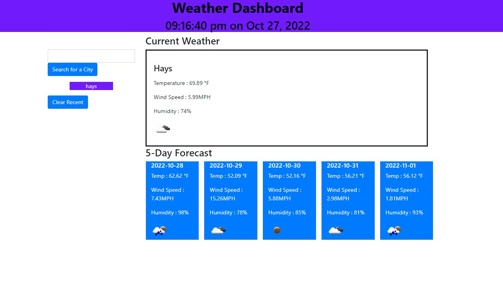

# weather_dashboard
# Solution for Module 6 Challenge

This site has been created as a source for weather information, dislplaying both the current weather, as well as a 5 day forcast for a desired location.  The entered locations are stored in local history, with the option to clear out what has been saved as well.  The weather and forcast both display temperature, windspeed, humidity, as well as an icon representing the visibility conditions.   

[Link to Page](https://fryylord.github.io/weather_dashboard/)

- [Installation](#installation)
- [Usage](#usage)
- [Credits](#credits)
- [License](#license)

## Installation

All you need is the index.html file, allong with the directory assets.  These should be in the parent repository directory, with assets being a child directly within the parent.

## Usage

To allow the user to enter in a desired city, get current weather information, as well as a 5 day forcast.  Searches are saved to allow for revisiting previously searched cities.       

## Credits

https://ku.bootcampcontent.com/ku-coding-boot-camp/KU-VIRT-FSF-PT-09-2022-U-LOLC/  
https://github.com/jrtwheeler/Weather-Dashboard/ 
https://github.com/kheller18/weather-dashboard/
https://github.com/jpecheverryp/weather-dashboard/
https://github.com/vmichalecki/weather-dashboard/

## License
 
MIT License

Copyright (c) 2022 fryylord

Permission is hereby granted, free of charge, to any person obtaining a copy
of this software and associated documentation files (the "Software"), to deal
in the Software without restriction, including without limitation the rights
to use, copy, modify, merge, publish, distribute, sublicense, and/or sell
copies of the Software, and to permit persons to whom the Software is
furnished to do so, subject to the following conditions:

The above copyright notice and this permission notice shall be included in all
copies or substantial portions of the Software.

THE SOFTWARE IS PROVIDED "AS IS", WITHOUT WARRANTY OF ANY KIND, EXPRESS OR
IMPLIED, INCLUDING BUT NOT LIMITED TO THE WARRANTIES OF MERCHANTABILITY,
FITNESS FOR A PARTICULAR PURPOSE AND NONINFRINGEMENT. IN NO EVENT SHALL THE
AUTHORS OR COPYRIGHT HOLDERS BE LIABLE FOR ANY CLAIM, DAMAGES OR OTHER
LIABILITY, WHETHER IN AN ACTION OF CONTRACT, TORT OR OTHERWISE, ARISING FROM,
OUT OF OR IN CONNECTION WITH THE SOFTWARE OR THE USE OR OTHER DEALINGS IN THE
SOFTWARE.

## Features

Simple user interface   
Adaptive for use on varying devices   
Local storage utilized for recalling previous user input   
Clock displaying current time in header
Current weather  
5 day forcast  

## Tests

None